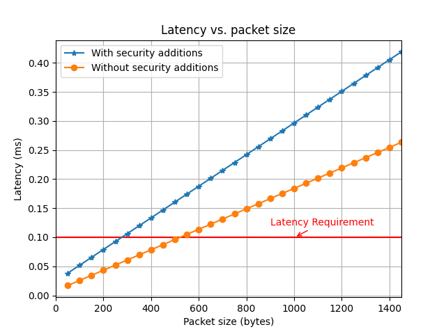

# zonal-filter

Evaluation and development repository for research into performant authentication and packet filtering in Automotive Ethernet zonal networks.

## Quick Tour

This repository is a single module designed for use within the [ns-3](https://www.nsnam.org/)
network simulator.

Experiments can each be found in the [`scripts/`](scripts/) directory.
Each experiment relies on a `.cc` runner file in [`examples/`](examples/) directory with supporting code 
in the [`helper/`](helper/) and [`model/`](model/) directories.

Processed results can be found in the `scripts/<experiment>/analyze.ipynb` 
notebooks.
Raw results can be found in the [`results/`](results/) directory for each
experiment.
For example, you can view the results of the first Zonal Latency Measurement
experiment by viewing [here](scripts/inter-zone-single-stream-vary-packet-size/analyze.ipynb).

## Current Experiments

| Experiment Name | Main Result File | Description |
|-----------------|------------------|-------------|
|`inter-zone-single-stream-vary-packet-size`|[`View Results!`](scripts/inter-zone-single-stream-vary-packet-size/analyze.ipynb)|Measures flow characteristics of a single UDP stream of packets from one node in one zone to another node in _another_ zone as the _packet size_ changes.|
|`intra-zone-single-stream-vary-packet-size`|[`View Results!`](scripts/intra-zone-single-stream-vary-packet-size/analyze.ipynb)|Measures flow characteristics of a single UDP stream of packets from one node in one zone to another node in _the same_ zone as the _packet size_ changes.|
|`inter-zone-single-stream-vary-throughput`|[`View Results!`](scripts/inter-zone-single-stream-vary-throughput/analyze.ipynb)|Measures flow characteristics of a single UDP stream of packets from one node in one zone to another node in _another_ zone as _throughput_ (i.e., sending datarate) changes.|
|`intra-zone-single-stream-vary-throughput`|[`View Results!`](scripts/intra-zone-single-stream-vary-throughput/analyze.ipynb)|Measures flow characteristics of a single UDP stream of packets from one node in one zone to another node in _the same_ zone as _throughput_ (i.e., sending datarate) changes.|

<p align="center">
  
</p>

_An example result from `inter-zone-single-stream-latency-vary-packet-size`. This shows how the 
latency of a UDP packet travelling across zones varies as a function of its packet size (specifically,
the size of its IP payload)._

## Basic Zonal Topology

**Network topology:**
 One or more zones with one or more endpoints each
 connected to a zonal gateway in a tree-like structure.

For example, a zonal network with `topology = {2, 3}`
 (two zones, one with 2 endpoints and one with 3) would look
 like this:

```
     ZONE ONE                       |                ZONE TWO
                                    |
n1.1 ----|                          |                          |---- n2.1
         |                                                     |
        n1.0 == n1.M ===== n1.N == nGW == n2.N ===== n2.M -- n2.0 -- n2.2
         |                                                     |
n1.2 ----|                          |                          |---- n2.3
```

where nodes are represented as:
 * `nGW`     - is the gateway
 * `n1.*`    - is the zone-one nodes (n1.1)
 * `n2.*`    - is the zone-two nodes (n2.1)
 * `n*.M`    - is the MACsec transceiver for a zonal controller (n1.M)
 * `n*.N`    - is the MACsec transceiver for the gateway on a given zone (n1.N) (NOTE * )
 * `n*.0`    - is the zonal controller for a zone (n1.0)

and where connections are respresented as:
 * `---`     - "Endpoint" Automotive Ethernet (e.g., 100Mbps)
 * `===`     - "Backbone" Automotive Ethernet (e.g., 1000Mbps)

Depending on the topology specified in the header file,
the simulation could have more zones with different numbers
of endpoints, etc.

> NOTE * :
>  Currently, we simulate our network with a MACsec transceiver on each side
   of each backbone connection (i.e., an inter-zonal message gets encrypted
   when leaving a zonal controller, decrypted when entering the gateway, encrypted
   when leaving the gateway, and then decrypted again when entering a zonal
   controller).
>
>  It is possible that we could implement the MACsec transceivers so that 
   we only have one per zone (such as one on each ZC, and allow the messsages
   to go through the GW encrypted).
>
>  This should be the topic of a future simulation, potentially implemented 
   with a switch in the configuration.

## Installation

To install this repository, please install the [ns-3](https://www.nsnam.org/) 
network simulator from our 
[Gitlab fork*](https://gitlab.com/evallen1/ns-3-dev.git) first, 
and then clone this repository in the
`contrib/` directory of `ns-3` to install it as a module:

```bash
git clone https://gitlab.com/evallen1/ns-3-dev.git ns-3
git clone https://github.com/evallen/zonal-filter ns-3/contrib/zonal-research
```

From the top level `ns-3` directory, configure `ns-3`:
```bash
./ns3 configure
```

Create a directory you wish your results to go into, such as
```bash
mkdir contrib/zonal-research/results/my-test
```

Then build and run the experiments in this directory, such as
```bash
./ns3 run 'contrib/zonal-research/examples/zonal-latency-measurement.cc --verbose' \
  --cwd contrib/zonal-research/results/my-test/
```

**We use our own fork of `ns-3` because we need to make certain functions
`virtual` so that we can override them in our implementation of the 
zonal network. This is not possible without modifying `ns-3`.*
