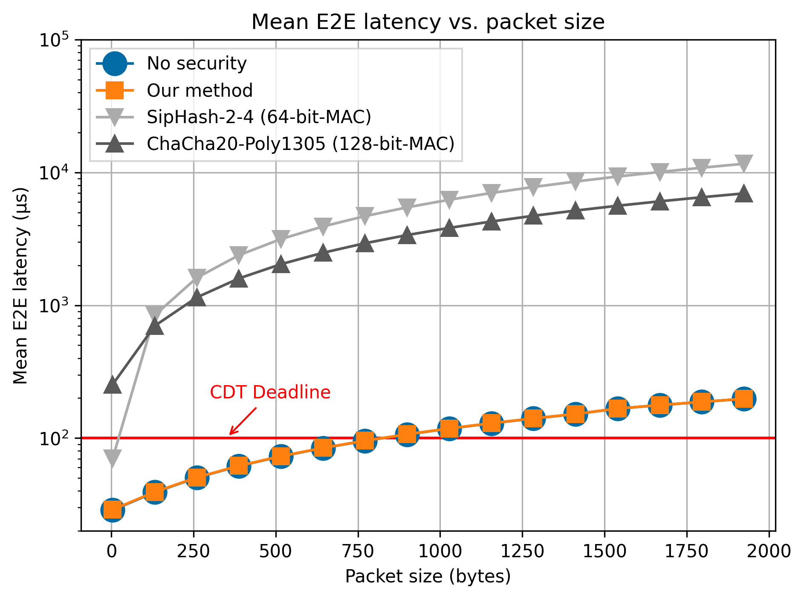

# Zonal In-Vehicle Network OMNeT++ Simulation Repository

This repository contains all the code and links to the data
used in the paper _The Advantages of Distributed TCAM Firewalls
in Automotive Real-Time Switched Zonal Networks_ accepted
at [VehicleSec '24](https://www.ndss-symposium.org/ndss2024/co-located-events/vehiclesec/) 
([paper link](https://www.ndss-symposium.org/ndss-paper/auto-draft-459/)).

All code here is organized in an 
[OMNeT++](https://omnetpp.org/) project and should be cloned into
your `samples` folder inside the OMNeT++ installation directory.

> [!IMPORTANT]
> **Please note:** This repository is complete except for the 
> `simulations/results` folder, which can be found compressed
> [here](https://drive.google.com/file/d/1Piy0YkufO3zVEJj4RluBtfzgrMDDdr5k/view?usp=sharing) (~2.5G) because it was too big to version control. Please
> download it and extract the contents to `simulations/results` to
> properly view the analysis graphs in `simulations/analysis.anf`.

## Results

Important result figures are shown here. For more detail, please
see the paper.

*End to end latency comparison of various security methods.*

*Mean E2E latency vs. packet size. Engine control packets had their packet
size varied.*

## Installation

These instructions assume basic familiarity with OMNeT++.

1. Install [OMNeT++](https://omnetpp.org/) with the
    [INET Framework](https://inet.omnetpp.org/). INET may already
    come with your OMNeT++ installation if you elect to automatically
    install related libraries. 

2. Clone this repository into the `samples/` directory of your 
   OMNeT++ installation directory.

## Usage

### Conduct analysis using our result data

1. Download the result data from the link above ([here](https://drive.google.com/file/d/1Piy0YkufO3zVEJj4RluBtfzgrMDDdr5k/view?usp=sharing)) and 
   decompress it into the `simulations/results` directory of this project.

2. Open the `analysis.anf` file in OMNeT++ and view the charts.

### Re-run the experiments

1. Open the project in OMNeT++ and open the `simulations/omnetpp.ini` file. 

2. This configuration file contains a variety of run configurations with
   a parameter to change the packet size of the Engine Control packets
   (see the packet size experiment in the paper). 

   To get data, run this `omnetpp.ini` file with the following run
   configurations, which correspond to various techniques evaluated
   in the paper:

   |Configuration Name|Paper Label|
   |------------------|-----------|
   | `AutomaticTsn`     | No security |
   | `OurMethod`        | Our method  |
   | `SipHash`          | SipHash-2-4 (64-bit MAC) | 
   | `ChaChaPoly`       | ChaCha20-Poly1305 (128-bit MAC) |

   The other configurations (`TimeSensitiveNetworkingBase`, 
   `Cryptography`, `General`) are abstract, base configurations from
   which other configurations are derived and should not be run directly. 

   The `Cmdenv` environment should run each of these trials for each of
   the possible values of `N`, the engine control packet size parameter.
   
   If you would like to view the simulation in a graphic window to see
   the packets flowing like in the figure above, change the runtime 
   environment to `Qtenv` in the
   run configurations tab. Note that you can only queue up one run (i.e.,
   one value of `N`) in this mode.
